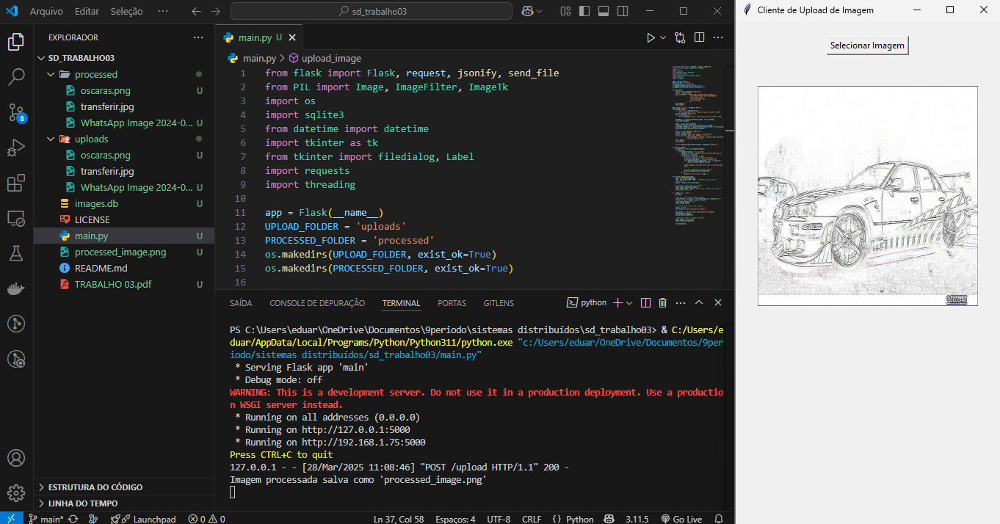

# Cliente de Upload e Processamento de Imagem com Tkinter e Flask

## 📌 Descrição do Projeto
Este projeto é um sistema que permite ao usuário selecionar uma imagem através de uma interface gráfica (Tkinter), enviá-la para um servidor Flask, onde um filtro é aplicado, e então visualizar a imagem processada diretamente na interface.

## 🚀 Tecnologias Utilizadas
- **Python**
- **Flask** para a API do servidor
- **Tkinter** para a interface gráfica do cliente
- **PIL (Pillow)** para manipulação de imagens
- **SQLite** para armazenar o histórico de imagens processadas
- **Requests** para enviar e receber imagens entre o cliente e o servidor

---

## ⚙️ Como Executar o Projeto

### 📌 1. Clonar o Repositório
```bash
 git clone https://github.com/eduardosousaa/sd_trabalho03
 cd sd_trabalho03
```

### 📌 2. Criar um Ambiente Virtual (Recomendado)
```bash
python -m venv venv
source venv/bin/activate  # No Linux/macOS
venv\Scripts\activate  # No Windows
```

### 📌 3. Instalar Dependências
```bash
pip install -r requirements.txt
```

### 📌 4. Executar o Servidor Flask e a Interface Tkinter
```bash
python main.py
```

---

## 📸 Prints da Interface


---

---

## 📜 Estrutura do Projeto
```
/
├── main.py                 # Código principal do servidor e interface Tkinter
├── images.db              # Banco de dados SQLite
├── uploads/               # Pasta para imagens enviadas
├── processed/             # Pasta para imagens processadas
├── assets/                # Pasta com capturas de tela
├── requirements.txt       # Dependências do projeto
├── README.md              # Documentação do projeto
```

---

## 📄 Licença
Este projeto está sob a licença MIT. Veja o arquivo **LICENSE** para mais detalhes.